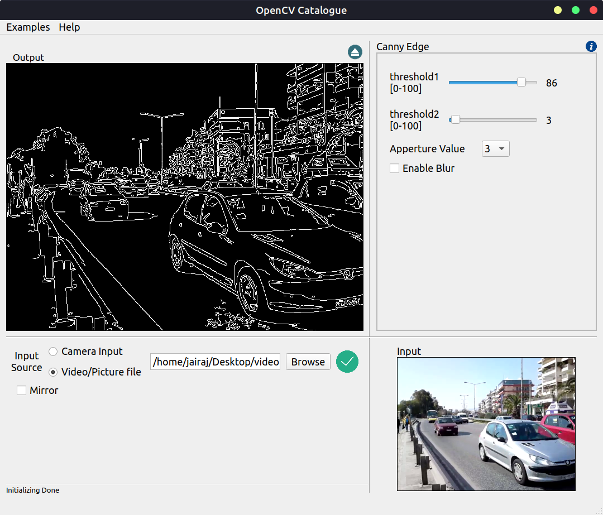

<!-- PROJECT SHIELDS -->

[![Contributors][contributors-shield]][contributors-url]
[![Forks][forks-shield]][forks-url]
[![Stargazers][stars-shield]][stars-url]
[![Issues][issues-shield]][issues-url]
[![MIT License][license-shield]][license-url]
[![LinkedIn][linkedin-shield]][linkedin-url]


<!-- PROJECT LOGO -->
<br />
<p align="center">
  <a href="https://github.com/JairajJangle/Open-CV-Catalogue">
    
  </a>

  <h3 align="center">OpenCV Catalogue</h3>

  <p align="center">
    A GUI application to view and test all OpenCV operations
    <br />
    <a href="https://github.com/JairajJangle/Open-CV-Catalogue"><strong>Explore the docs »</strong></a>
    <br />
    <br />
    <a href="https://github.com/JairajJangle/Open-CV-Catalogue">View Demo</a>
    ·
    <a href="https://github.com/JairajJangle/Open-CV-Catalogue/issues">Report Bug</a>
    ·
    <a href="https://github.com/JairajJangle/Open-CV-Catalogue/issues">Request Feature</a>
  </p>
</p>


<!-- TABLE OF CONTENTS -->
## Table of Contents

* [About the Project](#about-the-project)
  * [Built With](#built-with)
* [Getting Started](#getting-started)
  * [Prerequisites for contribution](#prerequisites-for-contribution)
  * [Build and run standalone application](#build-and-run-standalone-application)
* [Usage](#usage)
* [Roadmap](#roadmap)
* [Contributing](#contributing)
* [License](#license)
* [Contact](#contact)
* [Acknowledgements](#acknowledgements)


<!-- ABOUT THE PROJECT -->
## About The Project
TODO: Add gif

<p align="center">
  <a href="https://github.com/JairajJangle/Open-CV-Catalogue">
    
  </a>
</p>

OpenCV Catalogue is a stand alone application which is made to let OpenCV beginnners and veterans test any OpenCV operation without a need to code. This awesome GUI application lets the user control all parameters of an OpenCV operation using GUI elements such as Sliders/Seekbars, Input Text Box, Radio Buttons and Check Boxes.

This project is still in development and as of now covers primitive OpenCV operations. But, with the power of open sourcing, this application can be made to cover all the OpenCV operations, very soon.

This repository also contain release packages with standalone GUI application which anyone can run it on their Linux system. OpenCV Catalogue is primarily saves user's time with figuring out what parameter causes what changes on the output.

Features:
* Select camera, image files and video files as input source
* Real time ajustment of paramters of selected OpenCV operation
* Provide's link to official OpenCV documentation to selected OpenCV operation
* Paramter adjustment can be done with Seekbars, Text Boxes, Check Boxes, Radio Buttons.

Coming Soon:
* Exploded View of OpenCV operations to give more insights
* Multi-threading to keep GUI lag free while testing compute-heavy operations
* Chaining of various OpenCV operations in a sequence
* Support for CUDA operations

### Built With
* [C++](https://devdocs.io/cpp/)
* [QT](https://www.qt.io/)
* [OpenCV](https://opencv.org/)


<!-- GETTING STARTED -->
## Getting Started

Get started with contributing to OpenCV Catalogue

### Prerequisites for contribution
* [Install OpenCV](https://docs.opencv.org/trunk/df/d65/tutorial_table_of_content_introduction.html): Go for 3.x+ version
* [Install QT libs + QT Creator](https://www.qt.io/download-open-source)
* For development, supported platforms: Linux, MacOS, Windows

### Build and run standalone application

1. Build AppImage: TODO
```sh
<AppImage Build Commond here>
```
2. Running standalone .AppImage
```sh
cd <.AppImage File Location>
chmod +x <name of .AppImage File>
./<name of .AppImage File>
```

<!-- USAGE EXAMPLES -->
## Usage

Use this space to show useful examples of how a project can be used. Additional screenshots, code examples and demos work well in this space. You may also link to more resources.

TODO: Add Screenshots

_For more examples, please refer to the [Documentation](https://example.com)_


<!-- ROADMAP -->
## Roadmap

See the [open issues](https://github.com/JairajJangle/Open-CV-Catalogue/issues) for a list of proposed features (and known issues).


<!-- CONTRIBUTING -->
## Contributing

Contributions are what make the open source community such an amazing place to be learn, inspire, and create. Any contributions you make are **greatly appreciated**.

1. Fork the Project
2. Create your Feature Branch (`git checkout -b feature/AmazingFeature`)
3. Commit your Changes (`git commit -m 'Add some AmazingFeature'`)
4. Push to the Branch (`git push origin feature/AmazingFeature`)
5. Open a Pull Request


<!-- LICENSE -->
## License

Distributed under the GNU GPL v3 License. See `LICENSE` for more information.


<!-- CONTACT -->
## Contact

Your Name - [@JairajJangle](https://twitter.com/JairajJangle) - jairaj.jangle@gmail.com

Project Link: [https://github.com/JairajJangle/Open-CV-Catalogue](https://github.com/JairajJangle/Open-CV-Catalogue)


<!-- ACKNOWLEDGEMENTS -->
## Acknowledgements
* [GitHub Emoji Cheat Sheet](https://www.webpagefx.com/tools/emoji-cheat-sheet)
* [Img Shields](https://shields.io)
* [Choose an Open Source License](https://choosealicense.com)
* [GitHub Pages](https://pages.github.com)
* [Animate.css](https://daneden.github.io/animate.css)
* [Loaders.css](https://connoratherton.com/loaders)
* [Slick Carousel](https://kenwheeler.github.io/slick)
* [Smooth Scroll](https://github.com/cferdinandi/smooth-scroll)
* [Sticky Kit](http://leafo.net/sticky-kit)
* [JVectorMap](http://jvectormap.com)
* [Font Awesome](https://fontawesome.com)


<!-- MARKDOWN LINKS & IMAGES -->
<!-- https://www.markdownguide.org/basic-syntax/#reference-style-links -->
[contributors-shield]: https://img.shields.io/github/contributors/JairajJangle/Open-CV-Catalogue.svg?style=flat-square
[contributors-url]: https://github.com/JairajJangle/Open-CV-Catalogue/graphs/contributors
[forks-shield]: https://img.shields.io/github/forks/JairajJangle/Open-CV-Catalogue.svg?style=flat-square
[forks-url]: https://github.com/JairajJangle/Open-CV-Catalogue/network/members
[stars-shield]: https://img.shields.io/github/stars/JairajJangle/Open-CV-Catalogue.svg?style=flat-square
[stars-url]: https://github.com/JairajJangle/Open-CV-Catalogue/stargazers
[issues-shield]: https://img.shields.io/github/issues/JairajJangle/Open-CV-Catalogue.svg?style=flat-square
[issues-url]: https://github.com/JairajJangle/Open-CV-Catalogue/issues
[license-shield]: https://img.shields.io/github/license/JairajJangle/Open-CV-Catalogue.svg?style=flat-square
[license-url]: https://github.com/JairajJangle/Open-CV-Catalogue/blob/master/LICENSE.txt
[linkedin-shield]: https://img.shields.io/badge/-LinkedIn-black.svg?style=flat-square&logo=linkedin&colorB=555
[linkedin-url]: https://www.linkedin.com/in/jairaj-jangle-35aab3137/
[product-screenshot]: media/screenshot_canny.jpg
